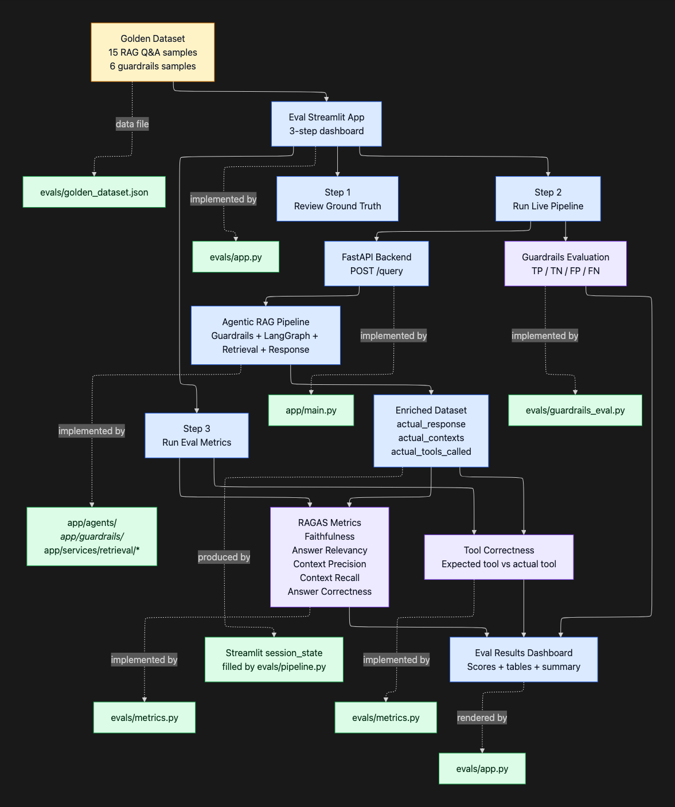

### Data Ingestion Commands

Here are the ingestion commands for the 3 useful cases.

**1. Ingest only clean data**
```bash
python -m app.ingestion.processor DATA/true_data true
```

**2. Ingest noisy data after clean data**
```bash
python -m app.ingestion.processor DATA/noisy_data/sample_5 noisy
```

**3. Ingest only 15 noisy files**
```bash
python -m app.ingestion.processor DATA/noisy_sample_10 noisy
```

Use --wipe when you want a fresh Qdrant collection. If you want to append noisy files after clean data, omit --wipe on the noisy ingestion command.

