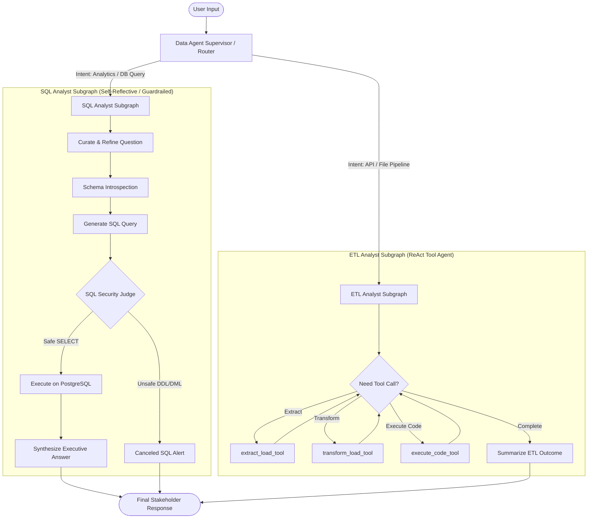

# Data Agent: Enterprise Multi-Agent Data Intelligence System

An industry-standard, multi-agent AI system built with **LangGraph**, **LangChain**, and **PostgreSQL**. The platform intelligently orchestrates natural language business intelligence queries, secure SQL execution with an automated security judge, and automated ETL (Extract, Transform, Load) pipelines.

---

## 🏛️ High-Level System Architecture

The system operates as a hierarchical multi-agent state machine:



---

## 🚀 Key Architectural Components

### 1. Supervisor / Router Agent (`agents/data_agent.py`)
- Uses structured output (`RouterSchema`) to classify user intent into `sql` or `etl`.
- Enforces system routing prompts ensuring questions about database tables (`users`, `rides`, `payments`, `ratings`, `vehicles`) route to SQL, while file ingestion, external APIs, and pandas manipulations route to ETL.

### 2. SQL Analyst Subgraph (`agents/sql_analyst.py`)
A self-reflective, 6-node state graph implementing database intelligence with safety guardrails:
1. **Curate Question (`curate_question`)**: Refines colloquial human questions into unambiguous analytical questions.
2. **Schema Introspection (`prompt_query_context`)**: Reads live catalog tables, column types, and top-5 sample records dynamically from PostgreSQL.
3. **SQL Generation (`generate_sql`)**: Employs reasoning models to write performant PostgreSQL queries with auto-limits.
4. **Safety Judge (`is_safe_sql`)**: Independent security judge validating read-only compliance (`JudgeSchema`). Any DDL (`DROP`, `ALTER`, `TRUNCATE`) or DML (`INSERT`, `UPDATE`, `DELETE`) is immediately halted.
5. **Database Execution (`execute_sql`)**: Executes query against PostgreSQL using auto-reconnecting `DatabaseUtil` and extracts column-labeled records.
6. **Executive Synthesis (`represent_final_answer`)**: Formats query outputs into readable markdown tables and stakeholder summaries.

### 3. ETL Analyst Subgraph (`agents/etl_analyst.py`)
A ReAct tool-calling agent equipped with specialized data engineering tools:
- **`extract_load_tool`**: Ingests datasets from REST APIs / HTTP endpoints into CSV, JSON, or Parquet.
- **`transform_load_tool`**: Previews source data shape and sample rows, synthesizes optimized Pandas code, executes it in a controlled context, and validates output file generation.
- **`execute_code_tool`**: Safely executes Python data scripts and captures `stdout` / tracebacks.

### 4. Resilient Database Layer (`utils/db.py`)
- Connection lifecycle management with auto-reconnection (`get_connection()`).
- Cursor isolation avoiding connection starvation.
- Dict-based query formatting preserving column headers.

---

## 🛠️ Quickstart & Setup

### Prerequisites
- Python 3.12+
- Docker & Docker Compose (for PostgreSQL)
- OpenAI API Key

### 1. Start PostgreSQL Database
```bash
docker compose up -d
```
The database container initializes with `data_agent_db` on port `5432` with pre-loaded mock tables (`users`, `rides`, `payments`, `ratings`, `vehicles`).

### 2. Configure Environment (`.env`)
Create or verify `.env`:
```env
OPENAI_API_KEY=your_openai_api_key_here

POSTGRES_HOST=localhost
POSTGRES_PORT=5432
POSTGRES_DB=data_agent_db
POSTGRES_USER=postgres
POSTGRES_PASSWORD=postgres
```

### 3. Install Dependencies
Using `uv`:
```bash
uv sync
```

---

## 💻 Running the Data Agent

### Interactive REPL Mode
Launch the rich interactive CLI:
```bash
uv run python main.py
```
Inside the interactive session:
```text
data-agent> What are the top 5 cities with the highest count of registered users?
data-agent> Extract pokemon 10 from https://pokeapi.co/api/v2/pokemon/10 into data/extract/caterpie.json as json
data-agent> tables
data-agent> demo
data-agent> exit
```

### Single Query Mode
Run a single question and receive structured markdown output:
```bash
uv run python main.py -q "What is the average fare for completed rides?"
```

### Database Tables Overview
Inspect row counts across all database tables:
```bash
uv run python main.py --tables
```

### Automated End-to-End Demo Suite
Run predefined SQL and ETL tests:
```bash
uv run python main.py --demo
```

---

## 📂 Project Directory Structure

```text
Data-Agent/
├── agents/
│   ├── data_agent.py      # Top-level supervisor router & compiled entrypoint
│   ├── sql_analyst.py     # SQL Analyst reflective subgraph with security judge
│   └── etl_analyst.py     # ETL Analyst ReAct agent with custom tools
├── models/
│   └── schema.py          # Pydantic schemas (AgentSchema, JudgeSchema, RouterSchema, DataAgentSchema)
├── utils/
│   ├── db.py              # Resilient PostgreSQL connection & query utility
│   ├── etl_tools.py       # API extraction, Pandas code generation & execution engine
│   └── llm_pick.py        # Parameterized LLM selector (low, medium, high)
├── data/
│   ├── extract/           # Output directory for extracted API datasets
│   ├── transform/         # Output directory for transformed datasets
│   └── generate_data.py   # Synthetic data generator for rideshare domain
├── docker-compose.yml     # PostgreSQL container definition
├── init.sql               # Database schema initialization script
├── main.py                # Rich CLI interface (interactive & single query)
└── pyproject.toml         # Dependencies and metadata
```
