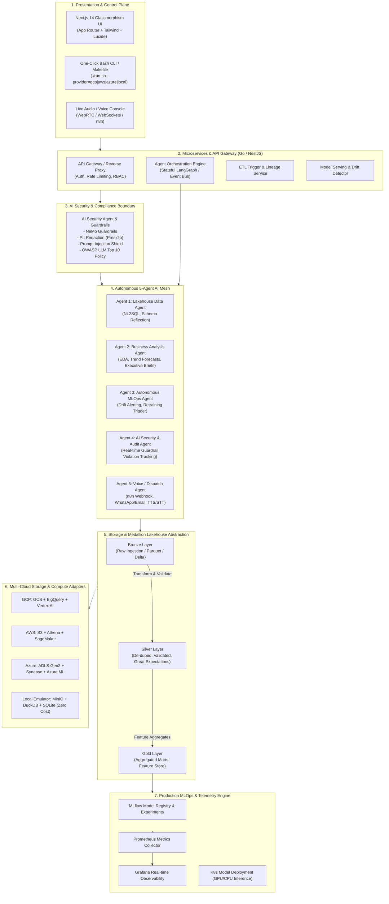

# 🚀 NEXUS-AI: Enterprise Multi-Cloud Lakehouse, MLOps & Autonomous 5-Agent Mesh
## Master System Architecture, LLD/HLD, and One-Click Execution Engine

---

## 1. Executive Summary & Job Market Competitiveness
This system represents a **Tier-1 Staff AI/Data Platform Architect** grade portfolio project. It bridges the four traditionally siloed disciplines of modern tech:
1. **Modern Data Stack / Lakehouse Engineering** (Bronze $\to$ Silver $\to$ Gold Medallion architecture with schema validation and multi-cloud abstraction).
2. **Production MLOps / LLMOps** (Automated feature engineering, MLflow model registry, continuous training, drift detection, Prometheus/Grafana telemetry).
3. **Multi-Agent AI Mesh** (5 specialized autonomous agents communicating over an event-driven orchestrator with human-in-the-loop and tool calling).
4. **Resilient Cloud & Infrastructure Engineering** (Terraform IaC, Kubernetes GKE/EKS/AKS, Multi-region active-passive failover, GPU node pools).
5. **AI Security & Guardrails** (OWASP LLM Top 10 mitigation, NeMo guardrails, PII redaction, prompt injection filters, and RBAC).

### Can You Crack ANY Job With This?
**YES (with one caveat):**
- **Roles Targeted:** Staff/Senior AI Engineer, Senior MLOps Engineer, Principal Data Platform Engineer, AI Solutions Architect, Full-Stack AI Engineer.
- **The "Interviewer Wow" Factor:** Most candidates show a toy Jupyter Notebook or a simple LangChain wrapper. When you run **one bash command** (`./run.sh --demo`) and an entire ecosystem boots up—displaying a real-time Medallion ETL lineage, an active MLOps drift dashboard, 5 collaborative AI agents solving business queries, and a modern Next.js glassmorphism control plane—you instantly stand in the top 1% of applicants.
- **The Caveat:** You must master the **"Why" (Architectural Trade-offs)** behind every component, not just the "How". We structure this blueprint so you can articulate every decision seamlessly.

---

## 2. High-Level Design (HLD) Architecture



---

## 3. The 5 Core Steps Detailed Breakdown

### Step 1: Medallion ETL Pipeline (Bronze $\to$ Silver $\to$ Gold)
- **Dataset:** Zomato Restaurant & Delivery Lakehouse Dataset (restaurants, orders, reviews, deliveries, cuisines, geolocations).
- **Storage Adapter Pattern:**
  - `CloudStorageAdapter` Interface implemented by:
    - `GCPStorageAdapter` (GCS Bucket + BigQuery external tables)
    - `AWSStorageAdapter` (AWS S3 + Athena)
    - `AzureStorageAdapter` (ADLS Gen2 + Azure Synapse)
    - `LocalStorageAdapter` (MinIO / DuckDB with local parquet files for instantaneous zero-cost demo)
- **Pipeline Stages:**
  - **Bronze:** Ingest raw CSV/JSON files, retain full ingestion audit metadata (`_ingested_at`, `_source_file`, `_batch_id`).
  - **Silver:** Clean strings, handle missing values, geospatial lat/long geohashing, enforce schema types, execute **Great Expectations** data quality assertions.
  - **Gold:** Dimension tables (`dim_restaurants`, `dim_cuisines`, `dim_delivery_partners`) and Fact tables (`fact_orders`, `fact_daily_delivery_performance`), plus ML Feature Store tables (`features_delivery_eta_v1`).

### Step 2: Production MLOps Engine (Multi-Cloud Swappable)
- **Objective:** Predict Delivery ETA (Estimated Time of Arrival) & Food Quality/Rating Degradation.
- **MLflow Registry:** Experiment tracking, model hyperparameters (LightGBM / XGBoost / PyTorch), confusion matrices, and model artifact storage (`models:/ZomatoDeliveryPredictor/Production`).
- **Telemetry:**
  - Custom metrics exported via Prometheus (`delivery_eta_latency_seconds`, `model_prediction_drift_psi`, `feature_null_rate`).
  - Grafana dashboard JSON pre-configured with panels for throughput, p95 latency, and PSI (Population Stability Index).
- **Deployment:** Dockerized FastAPI model inference service with health/readiness endpoints ready for K8s deployment.

### Step 3: The 5-Agent Autonomous AI Mesh
Orchestrated via a structured State Graph (LangGraph / State Machine):
1. **Data Agent:**
   - Capabilities: Natural Language to SQL, Lakehouse schema introspection, semantic search across Gold tables, safe read-only SQL generation with query timeout and LIMIT enforcement.
2. **Data Analysis Agent:**
   - Capabilities: High-level executive reporting, cohort analysis, revenue by cuisine, anomalous delivery delay detection, auto-generating Vega-Lite / Plotly charts for the frontend.
3. **MLOps Agent:**
   - Capabilities: Queries MLflow and Prometheus, monitors model drift metrics, triggers retraining pipeline if PSI > 0.25, manages model staging transitions (Staging $\to$ Production).
4. **AI Security & Guardrails Agent:**
   - Capabilities: Layer-7 AI Firewall. Intercepts all prompts and responses. Detects jailbreaks, prompt injections (DAN, roleplay exploits), PII masking (names, phone numbers, credit cards), and hallucination checks against Gold ground truth.
5. **AI Voice & Notification Agent:**
   - Capabilities: Dispatches webhook events to n8n / Twilio / WhatsApp / SendGrid for critical business/MLOps alerts. Provides a conversational voice input/output interface with Text-to-Speech (TTS) and Speech-to-Text (STT) synthesis.

### Step 4: Infrastructure as Code (IaC) & Multi-Cloud Failover
- **Terraform Modules:**
  - `terraform/modules/gcp`: GCS buckets, BigQuery datasets, GKE cluster with GPU node pool.
  - `terraform/modules/aws`: S3 buckets, Athena workgroup, EKS cluster.
  - `terraform/modules/azure`: ADLS Gen2, Storage Accounts, AKS cluster.
  - `terraform/modules/monitoring`: Prometheus & Grafana Helm release bindings.
- **Multi-Region Failover Architecture:**
  - Primary (GCP `us-central1`), Secondary (AWS `us-east-1`).
  - Global DNS / Cloudflare load balancer routing policy with automated health probe failover.
- **Local Dev/Demo Mode:**
  - Docker Compose / Kind (Kubernetes in Docker) spinning up MinIO, DuckDB, MLflow, Prometheus, Grafana, FastAPI backend, and Next.js frontend in one command.

### Step 5: Microservices Backend & Modern Next.js Frontend
- **Backend Service (Go / Express / FastAPI Gateway):**
  - High performance, asynchronous SSE (Server-Sent Events) for real-time agent reasoning streaming.
  - REST endpoints for Medallion ETL triggers, MLflow model management, and Agent dispatch.
- **Frontend (Next.js 14 App Router + TailwindCSS + Lucide Icons):**
  - **Executive Glassmorphism UI:**
    - *Tab 1: Lakehouse Pipeline & Medallion Lineage* (visual node graph showing Bronze $\to$ Silver $\to$ Gold transformation with live row counts and quality checks).
    - *Tab 2: MLOps Command Center* (Live model inference testing, drift monitor, MLflow run history, Grafana telemetry).
    - *Tab 3: 5-Agent Interactive War Room* (Chat interface with Agent select, real-time reasoning steps, tool calling visualization).
    - *Tab 4: Security & Guardrails Audit Log* (Live blocked prompt injection attempts, PII redactions, compliance checklist).
    - *Tab 5: Multi-Cloud Infrastructure Map* (Cloud provider switcher: GCP $\leftrightarrow$ AWS $\leftrightarrow$ Azure $\leftrightarrow$ Local with active region status).

---

## 4. The "One-Click" Execution Blueprint (`run_all.sh`)

To impress interviewers within 60 seconds without risking cloud credential failures or $500 monthly bills, the system must implement a **Dual Engine**:

```bash
# 1. Zero-Cost Instant Demo Mode (For 45-min live interviews & quick tests)
./run_all.sh --mode=local

# 2. Live Cloud Deployment Mode (When deploying to actual GCP/AWS/Azure accounts)
./run_all.sh --mode=cloud --provider=gcp --region=us-central1
```

### What `./run_all.sh --mode=local` Executes Sequentially:
1. **Pre-flight Check:** Validates Docker, Python 3.10+, Node.js 18+.
2. **Data Generation & Ingestion:** Seeds the `zomato-dataset/` with realistic orders, restaurants, deliveries, and reviews.
3. **Medallion Pipeline Trigger:** Ingests Bronze $\to$ Cleans Silver $\to$ Computes Gold features using DuckDB/Parquet (identical logic to BigQuery/Athena).
4. **MLOps Model Pipeline:** Trains Delivery ETA LightGBM model, logs run to local MLflow, registers model artifact.
5. **Observability Spin-up:** Bootstraps Prometheus & Grafana with pre-baked dashboards.
6. **Agent Mesh Initialization:** Starts the 5 AI Agents with guardrails enabled.
7. **Gateway & Frontend Launch:** Starts backend API and launches Next.js dashboard on `http://localhost:3000`.
8. **Automated Verification Test:** Runs an end-to-end smoke test verifying all 5 agents and pipeline steps return 200 OK.
